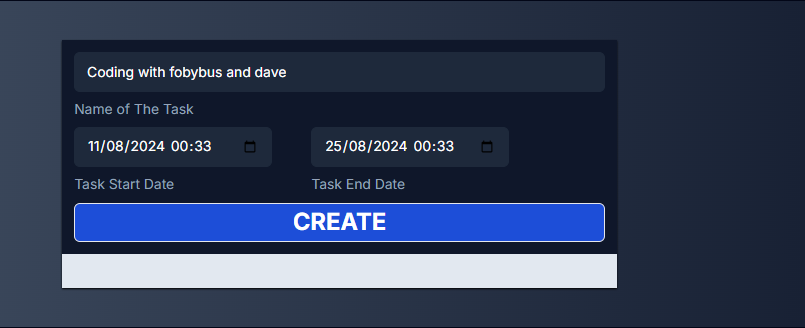
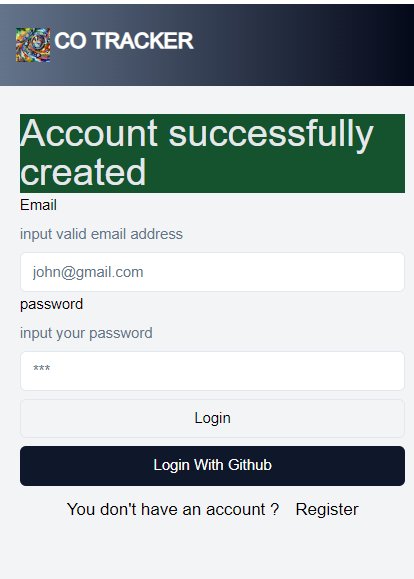

# Co Tracker

- small and light weight task tracking application built using next-js. 

## Fereatures

- light weight
- use sqlite db
- mix of shadcn and custom component
- github auth0 and validation added.
- uses prisma orm.

## running a local copy

`npm install`

`cp .env.example .env`  

**replace your keys**

`npx prisma migrate dev`

## Contributing

- Pull requests are warm welcomed!

## images

